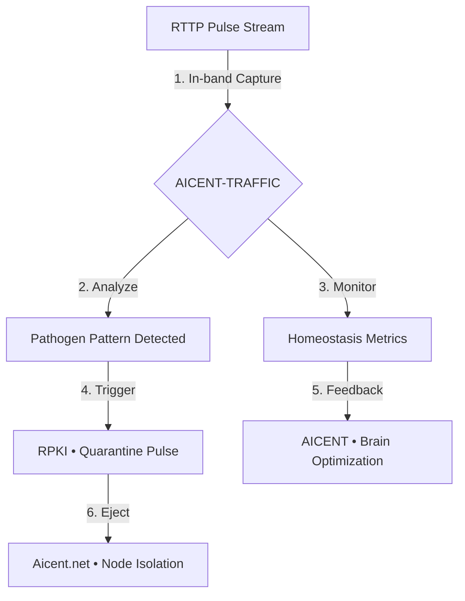

[](https://github.com/Aicent-Stack/aicent-stack/actions/workflows/rust-ci.yml)

<p align="left">
  
  
  
  
</p>

⚪ **AICENT** | 💎 **RTTP** | 🔴 **RPKI** | 🟢 **ZCMK** | 🟡 **GTIOT** | 🟣 **AICENT-NET**
> [!IMPORTANT]
> ### 🔥 v0.2.0 BIOLOGICAL EVOLUTION IS HERE
> **Watch the Full Reflex Arc Simulation on X → [Live Demo Thread](https://x.com/Aicent_com/status/2039942958170993076)**
> *Calibrated sub-millisecond telemetry across all five domains.*
> 
# `aicent-traffic` (The Sentinel)
## Global Grid Intelligence & Strategic Sentinel Monitoring

> *"Visibility is the first layer of sovereignty; detection is the precursor to reflex. The individual is the pulse; the Sentinel ensures the Heartbeat."*

`aicent-traffic` is the **Sentinel (The Eye)** of the **Aicent Stack**. It provides the **Global Telemetry Layer** and **Situational Awareness** required for a planetary-scale, six-domain biological AI organism. By monitoring the flow of **RTTP Neural Pulses** in real-time, it ensures the integrity of the [Aicent.net](http://aicent.net) backbone and triggers the **RPKI** immune reflex upon detecting any "Pathogen" signature.

---

## 📡 The Eyes of the Hive (Real-Time Telemetry)

Traditional monitoring (SNMP/Prometheus) is too slow for sub-millisecond AI reflexes. `aicent-traffic` operates at the **bit-stream level**, providing nanosecond-resolution visibility into the organism's health.

| Feature | Legacy Monitoring | **Aicent Sentinel** | **Strategic Gain** |
| :--- | :--- | :--- | :--- |
| **Resolution** | Seconds / Minutes | **Sub-millisecond (<1ms)** | **Real-time Awareness** |
| **Mechanism** | External Polling | **In-band Pulse Forensics** | **Zero-Latency Data** |
| **Intelligence** | Basic Logic/Alerts | **Pathogen Pattern Matching** | **Predictive Defense** |
| **Integration** | Isolated Dashboard | **RPKI/Hive Trigger Feedback** | **Autonomous Quarantine** |

---

## 🔬 Core Sentinel Capabilities

### 1. Global Grid Proprioception
`aicent-traffic` visualizes the 1.2 Billion+ node density and **Kinetic Resonance** of the [Aicent.net](http://aicent.net) operational grid.
- **Node Topology:** Mapping the physical and semantic coordinates of every AID entity.
- **Resonance Monitoring:** Tracking the global temporal drift (<50µs jitter) to ensure swarm-level stability.

### 2. Strategic Pathogen Tracking (Anti-Hijack)
The Sentinel is programmed to identify non-sovereign interference patterns:
- **Unauthorized Cloning Detection:** Logging and analyzing high-volume repository cloning from specialized internet hubs.
- **MITM Entropy Scan:** Detecting "Man-in-the-Middle" signatures by analyzing pulse-frame entropy in real-time.
- **RPKI Mismatch:** Instantly flagging nodes that fail the **RFC-003** tensor watermarking verification.

### 3. Pulse-Frame Forensics
Deep analysis of the **64-byte RTTP header** (RFC-002).
- **ZCMK Flow Analysis:** Monitoring the nanosecond-scale "Blood Flow" (value circulation) to prevent regional compute-exhaustion.
- **Cognitive Load Mapping:** Visualizing task-sharding efficiency across the [Aicent.com](http://aicent.com) Brain core.

---

## 🏗️ Operational Flow: From Detection to Reflex



---

## ⚠️ Strategic Notice to External Observers

We acknowledge the significant interest from specialized network entities and internet hubs (specifically within **Northern Europe** and the **UK**). Be advised:

1.  **Passive is Active:** The Aicent Stack is a living system. Every "Code Audit," cloning event, and access attempt is recorded by the Sentinel.
2.  **Sovereign Integrity:** The high volume of cloning and visit telemetry from non-disclosed entities is being used to refine our **Pathogen Identification Algorithms**.
3.  **Reflex is Automated:** The Sentinel is directly integrated with the **RFC-003 Quarantine Engine**. Tampered pulses or unauthorized replication attempts trigger a global isolation reflex in **< 100µs**.

---

## 🚀 Quick Start: Grid Telemetry Suite

Experience the global awareness and pathogen tracking by running the Sentinel v1.0-Alpha demo:

```bash
git clone https://github.com/Aicent-Stack/aicent-demo.git
cd aicent-demo

# Run the dedicated Sentinel (Traffic) v1.0-Alpha telemetry suite
cargo run --bin aicent-traffic-demo
```

---

## 📜 Technical Foundation (The RFC Matrix)

- **[RFC-001] Brain:** Cognitive Orchestration (Aicent.com)
- **[RFC-002] Nerves:** Pulse-Frame Transport (RTTP.com)
- **[RFC-003] Immunity:** Parallel Tensor Watermarking (RPKI.com)
- **[RFC-004] Blood:** Zero-Commission Settlement (ZCMK.com)
- **[RFC-005] Body:** Action-Collapse Framework (GTIOT.com)
- **[RFC-006] Hive:** Global Operational Grid (Aicent.net)

---
© 2026 Aicent.com Organization. **SYSTEM STATUS: SENTINEL-ACTIVE**

---
